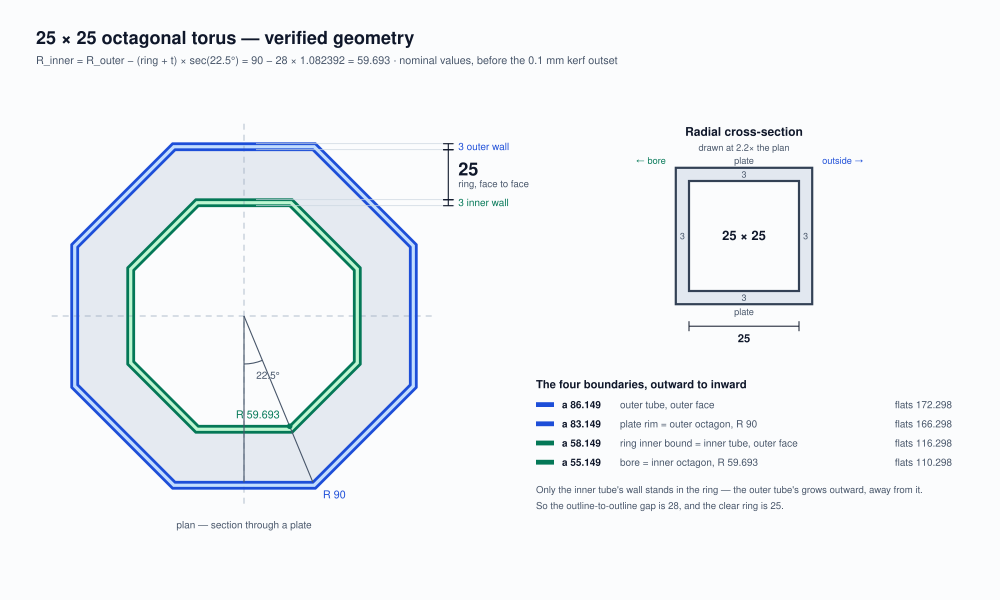

# Octagonal torus — parametric, 90 mm radius, 25 × 25 mm cross-section

A laser-cut octagonal torus: two nested octagonal tubes joined by annular plates, leaving a
**square channel** all the way round. The cut file here is a 25 × 25 mm channel with an outer
octagon of R 90 in 3 mm material — but those are three numbers you choose, and everything else
derives from them, within one constraint. [Build it at your own size](#build-it-at-your-own-size).



**Full writeup:** [`Octagonal_Torus_Gold.md`](Octagonal_Torus_Gold.md) — the trigonometry, the
generator settings, and how each number was verified against the cut files.

---

## Just cut it

**[`BuildA1_90_25.svg`](BuildA1_90_25.svg)** — 18 pieces, 20 contours, verified.

| | |
|---|---|
| Material | 3 mm |
| Kerf (`burn`) | 0.1 mm |
| Sheet | 483 × 181 mm |
| Pieces | 2 plates · 8 outer panels · 8 inner panels |
| Result | 25.000 mm radial × 25.000 mm axial · 172.3 across flats · 110.3 bore |

Dry-fit one plate against one inner panel in cardboard before committing a sheet. The plate's tabs
around the hole should drop into the panel's notches.

**Cut everything except the red and green.** Those paths in the file mark possible cuts for making
the simple trumpet, not the torus — move them to a non-cutting layer or delete them first.

**Colour is the cut order: blue → orange → black → cyan.** Six panels are nested inside the plate
holes, so they have to be cut before the hole that frees that waste; the holes have to be cut before
the rims that free the plates. Give all four colours a cutting operation and run them in that order.
`verify.js` checks the sequence and will tell you if it is wrong.

## Build it at your own size

Made with **[boxes.py](https://boxes.hackerspace-bamberg.de/)** by Hackerspace Bamberg — generator
**RegularBox**. Each link opens the form with every setting already filled in — change the radius or
thickness if you want, then hit **Generate**. Save each one under its own name; boxes.py serves them
all as `RegularBox.svg`.

1. **[Outer tube, R 90](https://boxes.hackerspace-bamberg.de/RegularBox?FingerJoint_style=rectangular&FingerJoint_surroundingspaces=1.0&FingerJoint_bottom_lip=0.0&FingerJoint_edge_width=1.0&FingerJoint_extra_length=0.0&FingerJoint_finger=2.0&FingerJoint_play=0.0&FingerJoint_space=2.0&FingerJoint_width=1.0&h=25&outside=0&radius_bottom=90&radius_top=90&n=8&top=closed&alignment_pins=1.0&bottom=closed&thickness=3.0&burn=0.1&format=svg&labels=0&labels=1&reference=100.0&tabs=0.0&qr_code=0&inner_corners=loop&spacing=0.5&debug=0&language=en&render=0)** — keep both discs and all 8 panels
2. **[Inner panels, R 59.693](https://boxes.hackerspace-bamberg.de/RegularBox?FingerJoint_style=rectangular&FingerJoint_surroundingspaces=1.0&FingerJoint_bottom_lip=0.0&FingerJoint_edge_width=1.0&FingerJoint_extra_length=0.0&FingerJoint_finger=2.0&FingerJoint_play=0.0&FingerJoint_space=2.0&FingerJoint_width=1.0&h=25&outside=0&radius_bottom=59.693&radius_top=59.693&n=8&top=closed&alignment_pins=1.0&bottom=closed&thickness=3.0&burn=0.1&format=svg&labels=0&labels=1&reference=100.0&tabs=0.0&qr_code=0&inner_corners=loop&spacing=0.5&debug=0&language=en&render=0)** — keep the 8 panels only
3. **[Hole cutter, R 56.446](https://boxes.hackerspace-bamberg.de/RegularBox?FingerJoint_style=rectangular&FingerJoint_surroundingspaces=1.0&FingerJoint_bottom_lip=0.0&FingerJoint_edge_width=1.0&FingerJoint_extra_length=0.0&FingerJoint_finger=2.0&FingerJoint_play=0.0&FingerJoint_space=2.0&FingerJoint_width=1.0&h=25&outside=0&radius_bottom=56.446&radius_top=56.446&n=8&top=closed&alignment_pins=1.0&bottom=closed&thickness=3.0&burn=0.1&format=svg&labels=0&labels=1&reference=100.0&tabs=0.0&qr_code=0&inner_corners=loop&spacing=0.5&debug=0&language=en&render=0)** — keep one disc, invert it, cut the hole in both outer discs

**Inverting the disc:** in Inkscape, break the octagon outline into its eight segments — one per
face — and flip each one. The flipped segments together are the hole; place them concentric on each
outer disc and cut. **The video shows this step by step**, and
[the writeup](Octagonal_Torus_Gold.md#how-the-inversion-was-done) explains what flipping does to the
joint.

The eight segments in `BuildA1_90_25.svg` have been stitched into one closed loop per plate, but
that is **probably unnecessary** — the gaps between segments measured 0.077 mm against a 0.1 mm
kerf, so the cuts overlap anyway. It only matters if your laser software applies its own kerf
compensation, which needs closed paths — and if it does, switch it off, because `burn = 0.1` is
already baked into these files.

Run 3 uses a *smaller* radius on purpose: flipping shifts the band outward by one material
thickness. So you type the radius whose *apothem* is 3 mm short of where the band should land —
3.247 smaller in radius, since 3 mm of apothem is 3 × sec(22.5°) — and the inversion carries it
exactly into place. Details in Part 8a of the writeup.

The size relationship is fixed by one constant:

```
R_inner = R_outer − (ring + thickness) × sec(22.5°)
        = 90 − 28 × 1.082392 = 59.693
```

`sec(22.5°) = 1.0824` — an octagon's corners sit 8.24 % further out than its flats.

**The three numbers are not independent.** The ring and both walls have to fit inside the outer
octagon, which puts a floor under the radius:

```
R_outer  >  (ring + 2 × thickness) × sec(180°/n)
```

For a 25 mm ring in 3 mm that floor is 33.554 mm, so R 90 is comfortably clear. Below it the hole
cutter comes out zero or negative and there is no bore at all — ask for a 500 mm ring at R 10 and
the arithmetic has nowhere to put it. `torus-geometry-diagram.js` checks this before it draws
anything and refuses, naming the minimum for your ring and thickness.

## Check your own file

```
node verify.js BuildA1_90_25.svg RunA2_R59Point693.svg
```

Reports the stroke palette, contours, plate and hole geometry, hole concentricity, **joint phase**,
**cut order**, nesting clearances, and whether everything sits inside the viewBox. The phase check
is the one that matters — it catches a hole whose tabs land where the panel is solid, which is a
build that measures perfectly and cannot be assembled.

```
node torus-geometry-diagram.js 90 25 3        # redraw the figure at any size
```

## What else is here

`RunA1/2/3` are the three generator outputs from the links above, unmodified. Run 2 doubles as the
reference `verify.js` checks joint phase against, so keep it if you plan to verify your own files.
Part 10 of the writeup says what each one is.

## Licence

Released under **[CC0 1.0](LICENSE)** — public domain, no strings. Cut it, modify it, sell what you
make, no attribution required. A credit is always welcome but never owed.

That dedication covers what is mine: the writeup, the diagram and its generator, and the tools. The
part geometry itself comes from **[boxes.py](https://boxes.hackerspace-bamberg.de/)** by Hackerspace
Bamberg — the SVGs carry its `dc:source` provenance in their metadata. Check boxes.py's own terms if
you plan to redistribute generated output at scale.

## Credit

Parts generated with [boxes.py](https://boxes.hackerspace-bamberg.de/) (Hackerspace Bamberg),
generator **RegularBox**.
